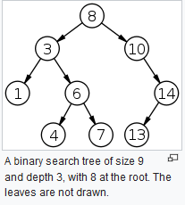
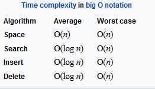

## __Data Structures__ are __Containers__ to store __Data__. Each of them is unique and can be more efficient than others depend on the type of problems. 
## __Algorithms__ are __Instructions__ to the computer on how to solve a given problem.
## A __Computer Program__ is a _collection_ of __Data Structures__ and __Algorithms__ to solve a given problem.

____
# Binary Search Tree(Sorted Binary Trees)
**_Cool Fact_**: The tree inherits the same advantage in runtime as the _binary search_.   
**Depth**: Sum of edges or path to get to that node.  
**Leaf Node**: No children 
**Traversing**: Looping __recursively__ through the tree.

## __Advatantages__
* Can __insert and delete (linked list), and search(array)__  data at a very fast pace.

## __Requirements__
* Tree has to insert data in order.
* Nodes can't have more than 2 children
* Left child has to be __<__ than the parent.
* Right child has to be __>=__ than the parent.

  

